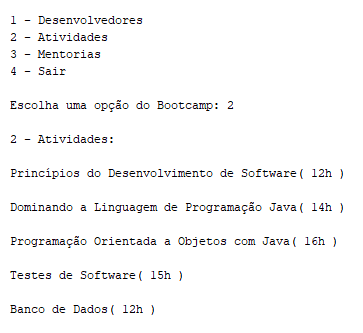

# POO - Desafio - Bootcamp
## Projeto Java
#### Por: DIO (Digital Innovation One)

### Sobre o Projeto

Um projeto de programa que exibe os dados do Bootcamp e um menu com opções de escolha, permitindo ao usuário selecionar entre Desenvolvedores, Atividades, Mentorias ou Sair. O programa repete até o usuário escolher a opção "Sair", momento em que exibirá "Programa finalizado."

##### About the project

A program project that displays Bootcamp data and a menu with choice options, allowing the user to select between Developers, Activities, Mentoring or Leave. The program repeats until the user chooses the "Exit" option, at which point it will display "Program Completed."

### Diagrama de Classe do Projeto
##### Project Class Diagram

")

### Organização do Projeto
##### Project Organization

")

### Imagens do Projeto:
##### Project Images

Opção 1 (Option)

Opção 2 (Option)

Opção 3 (Option)

Opção 4 (Option)

### Mensagens de Erros Possíveis
##### Possible Error Messages

Erro ao digitar letra no lugar de número (Error when typing letter in place of number):

### Ferramentas de Desenvolvimento

<table>
    <head>
        <tr><th>IDE</th><th>Versão</th><th>Paradgma</th></tr>
    </head>
    <body>
        <tr><td>Netbeans</td><td>JDK (Java 17)</td><td>Orientação a Objetos</td></tr>        
    </body>
</table>

##### (Development Tools)

<table>
    <head>
        <tr><th>IDE</th><th>Version</th><th>Paradigm</th></tr>
    </head>
    <body>
        <tr><td>Netbeans</td><td>JDK (Java 17)</td><td>Object Orientation</td></tr>        
    </body>
</table>

### Dados do Projeto

<table>
    <head>
        <tr><th>Projeto</th><th>Pacotes</th></tr>
    </head>
    <body>
        <tr>
            <td>Bootcamp</td>
            <td>
                br.com.projeto.aplicacao 
                br.com.projeto.modelos 
                br.com.projeto.excessoes 
            </td>
        </tr>
    </body>
</table>

##### Project data

<table>
    <head>
        <tr><th>Project</th><th>Packages</th></tr>
    </head>
    <body>
        <tr>
            <td>Bootcamp</td>
            <td>
                br.com.projeto.aplicacao 
                br.com.projeto.modelos 
                br.com.projeto.excessoes 
            </td>
        </tr>
    </body>
</table>

### Técnicas Utilizadas

* Classe Scanner: Entrada de Dados
* Variáveis: Tipo Primitivo/Referência
* Estrutura de Repetição: While/For
* Classe System: Métodos de Saída
* Exception: Customizadas/try/catch

##### (Techniques Used)

* Scanner Class: Data Input
* Variables: Primitive/Reference Type
* Repetition Structure: While/For
* System Class: Output Methods
* Exception: Customized/try/catch

### Autor (Author)
#### Katarine Albuquerque
###### Desenvolvedora Front-end (Developer)
   
